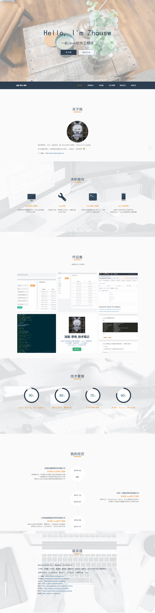

# 赛蜗牛-吴少雄的个人简历

### 介绍
**个人简历-纯静态页面，无后台**

> **预览 ➡️ [https://resume/saiwoniu.com](https://resume/saiwoniu.com)**

**一直在努力,从未放弃**
> 不浮躁，不偏激，不守旧，爱编程，爱后端，爱新技术，爱运动，爱旅行，执行力和学习能力都棒棒哒！

# 简介
- [个人博客](https://blog.saiwoniu.com)
- [博客园](https://www.cnblogs.com/iwsx/)
- **主要涉及技术：`Java后端开发`、`.Net后端开发`、`开源爱好者`、`Linux`**

**本项目源于：[https://github.com/Redspitee/Cv](https://github.com/Redspitee/Cv "https://github.com/Redspitee/Cv")。向作者表示深深的敬意。**